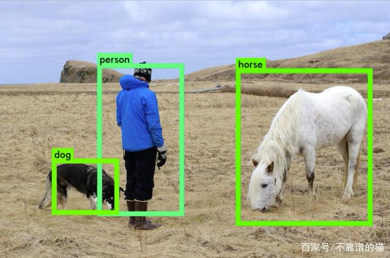
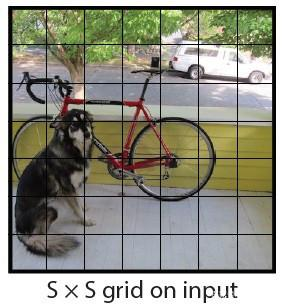
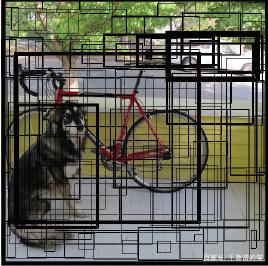
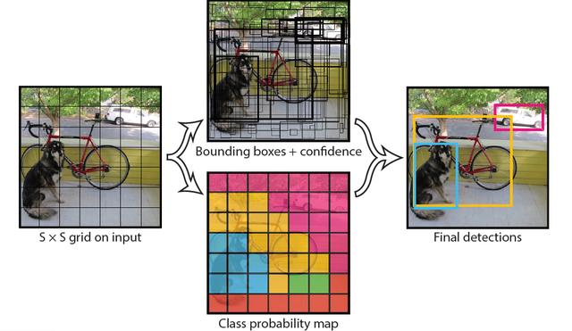
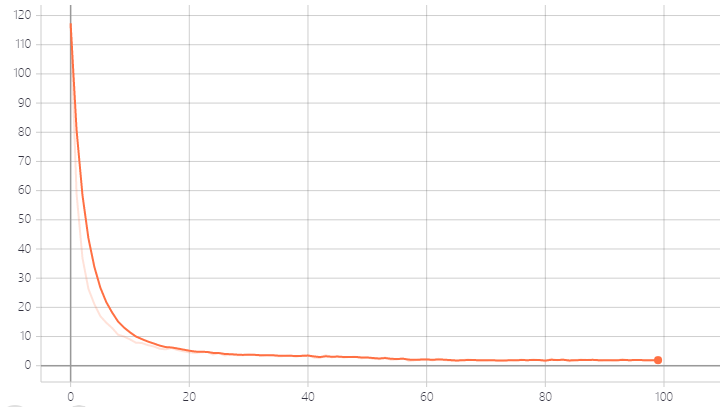
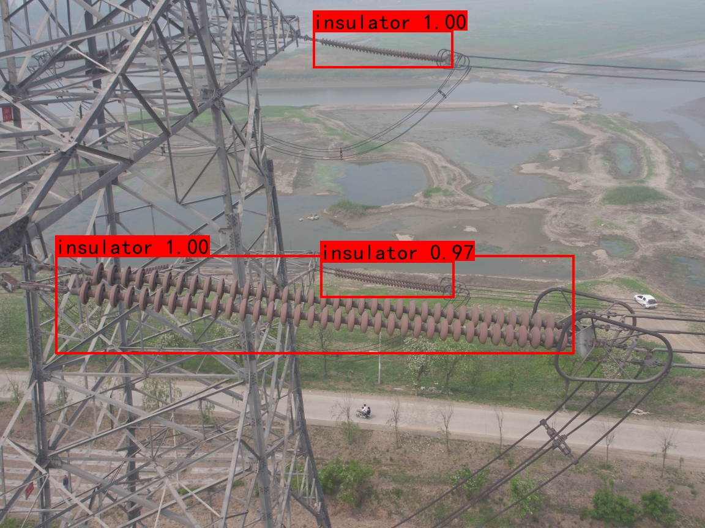
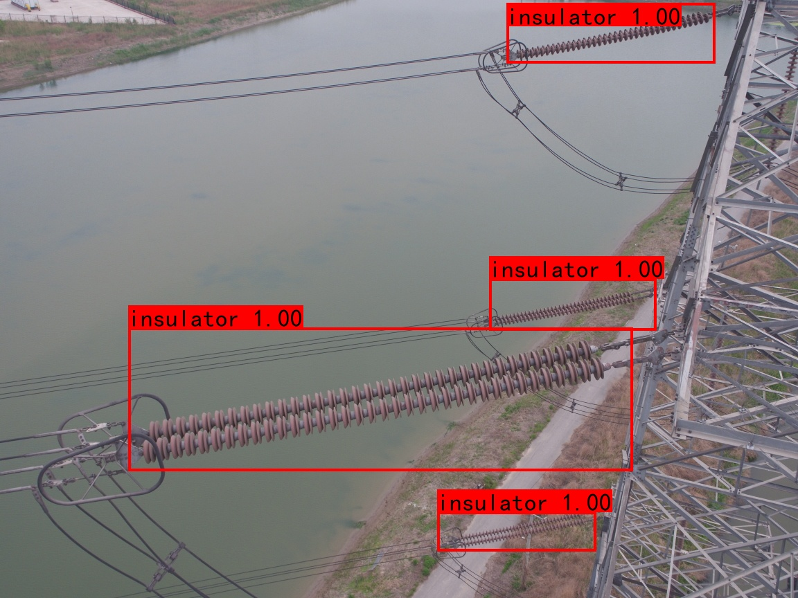

# YoloV4_Insulators

### 一、项目简介

Yolo_Insulators是一个基于YoloV4的绝缘子目标检测程序，人工智能课程设计作业。

**依赖**：

- Python3.6
- Pytorch1.2.0
- CUDA10.0

### 二、Yolo算法简介 [转](https://baijiahao.baidu.com/s?id=1664853943386329436&wfr=spider&for=pc)

“You Only Look Once”或“YOLO”是一个对象检测算法的名字，这是Redmon等人在2016年的一篇研究论文中命名的。YOLO实现了自动驾驶汽车等前沿技术中使用的实时对象检测。让我们看看是什么使该算法如此受欢迎，并概述其工作原理。



#### 1、背景

**实时的重要性**

人们看到图像以后，可以立即识别其中的对象、它们的位置和相对位置。这使得我们能够在几乎无意识的情况下完成复杂的任务，比如开车。因此，对汽车进行自动驾驶训练需要类似水平的反应能力和准确性。在其最基本的形式中，这样的系统必须能够分析实时视频中的道路，并能够在继续确定路径之前检测各种类型的对象及其在现实世界中的位置，所有这些都必须是实时的。

**在YOLO之前**

先前的检测系统使用分类器对测试图像的不同切片进行评估。例如，Deformable Parts Model (DPM)涉及到在图像中均匀间隔的位置上滑动窗口并在这些部件上运行分类器。R-CNN(Region-based Convolutional Neural Networks)是另一种模型，它运行一种分割算法将一幅图像分割成一个个小块，然后在这些小块上运行一个分类器。但是，速度慢、优化困难一直困扰着这种YOLO之前的系统。

#### 2、YOLO算法

YOLO将对象检测重新定义为一个回归问题。它将单个卷积神经网络(CNN)应用于整个图像，将图像分成网格，并预测每个网格的类概率和边界框。例如，以一个100x100的图像为例。我们把它分成网格，比如7x7。



然后，对于每个网格，网络都会预测一个边界框和与每个类别（汽车，行人，交通信号灯等）相对应的概率。



每个边界框可以使用四个描述符进行描述：

边界框的中心高度宽度值映射到对象所属的类

此外，该算法还可以预测边界框中存在对象的概率。如果一个对象的中心落在一个网格单元中，则该网格单元负责检测该对象。每个网格中将有多个边界框。在训练时，我们希望每个对象只有一个边界框。因此，我们根据哪个Box与ground truth box的重叠度最高，从而分配一个Box来负责预测对象。

最后，我们对每个类的对象应用一个称为“非最大抑制（Non Max Suppression）”的方法来过滤出“置信度”小于阈值的边界框。这为我们提供了图像预测。



#### 3、重要性

YOLO非常快。由于检测问题是一个回归问题，所以不需要复杂的管道。它比“R-CNN”快1000倍，比“Fast R-CNN”快100倍。它能够处理实时视频流，延迟小于25毫秒。它的精度是以前实时系统的两倍多。同样重要的是，YOLO遵循的是“端到端深度学习”的实践。

### 三、文件结构

```
.
├─img						# 存放预测后的图像
├─logs						# 存放训练的模型文件
├─model_data				# 存放预训练模型
├─nets						# 网络结构
├─utils						# 数据加载、NMS等
├─VOCdevkit					# VOC数据集
   └─VOC2007
       ├─Annotations		# 标注XML文件
       ├─ImageSets			
       │  └─Main
       └─JPEGImages			# 数据集图片
```


### 三、数据集

数据集采用网上开源的绝缘子数据集，共600张图片。数据集格式使用VOC2007，标注文件为xml。

你可以通过百度网盘来下载[绝缘子数据集-提取码：djuf ](https://pan.baidu.com/s/1z_J9tx-151FFAVW9ASJz9A )，以下是部分数据集图片。


若需要扩增自己的数据，可以使用[labelimg](https://github.com/tzutalin/labelImg)来标注新的数据，注意标签为insulator。

#### 如何制作数据集

将数据集图片存放至`VOCdevkit/VOC2007/JPEGImages`目录，再将标注文件放至`VOCdevkit/VOC2007/Anootations`目录。

执行

```
python VOCdevkit/VOC2007/voc2yolo4.py
python voc_annotation.py
```

运行成功后会在`VOCdevkit/VOC2007/ImageSets/Main`目录生成训练需要的文件。

### 四、训练模型

由于数据集数量较小，直接训练模型收敛效果可能不佳，达不到高识别率。绝缘子识别是目标检测的一个子应用，其模型的很多参数与其他目标检测的参数相似，因此可以通过一个在完备的数据集上训练好的模型通过迁移学习应用到绝缘子识别上，可以在数据集较小的情况下使模型快速收敛，实现更高的准确率。

迁移学习策略：先冻结CSPDarknet53网络， 只训练FPN部分，后期再将CSPDarknet53解冻，在全网络上训练模型。

在`train.py`中可以通过设置`Cosine_lr`、`mosaic`和`smoooth_label`来设置是否采用余弦退火策略、mosaic数据增强和标签平滑等。训练集和验证集默认比例为9:1，可在`train.py`文件中修改`val_split`参数来调整比例。同时也可以调整参数`lr`、`Batch_size`、`Epoch`来修改学习率、批大小及迭代次数。

训练模型只需运行

```
python train.py
```

训练好的模型会存在`log`文件下。

你可以通过百度网盘来下载我已经训练好的[模型-提取码：t9ct](https://pan.baidu.com/s/1bGBd9821KCpcgOTRuHQseg)，以下是训练模型loss的变化，



### 五、测试模型

若使用自己训练的模型，需要在根目录的`yolo.py`中修改`model_path`的路径。不过也可以使用这里训练好的[模型-提取码：t9ct](https://pan.baidu.com/s/1bGBd9821KCpcgOTRuHQseg)，下载模型后将模型文件放入`logs`文件夹即可。在`predict.py`中修改`imgPath`为需要预测的图片路径，运行

```
python predict.py
```

即可弹出预测成功的窗口，并将预测的结果存放至`img`文件夹中。

以下为我训练的模型的部分测试结果。



